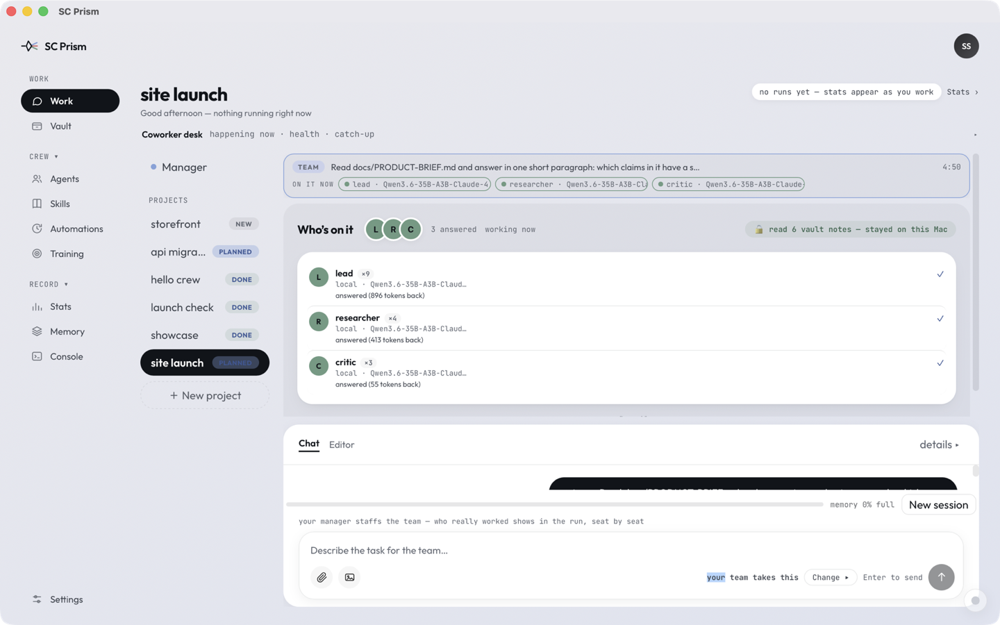
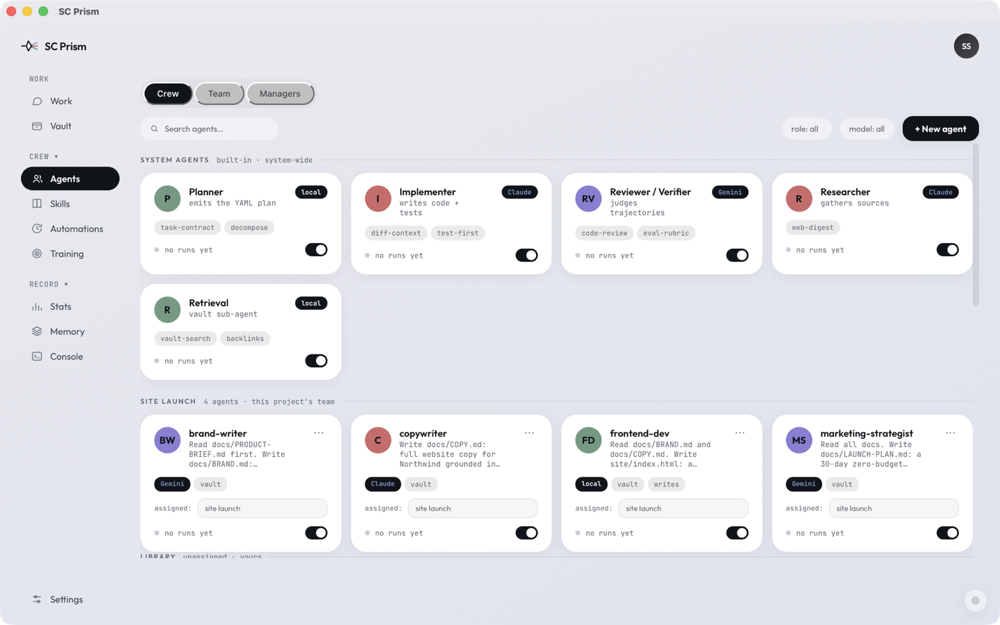
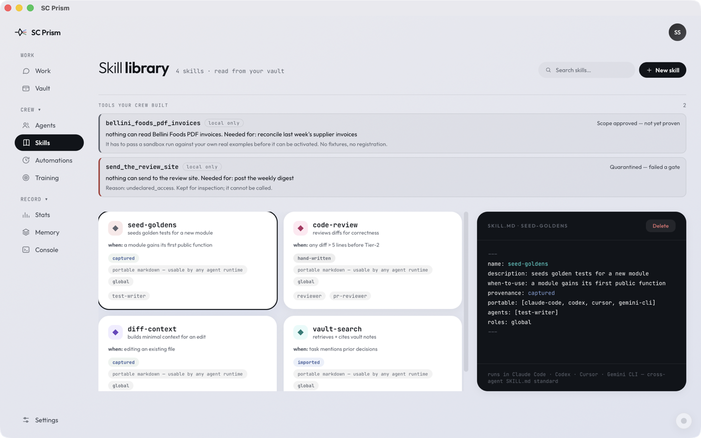
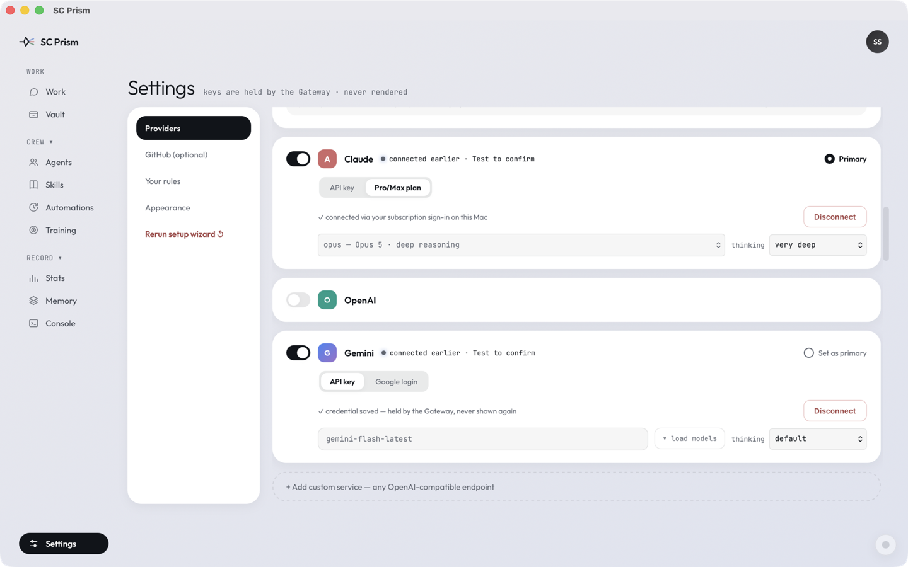
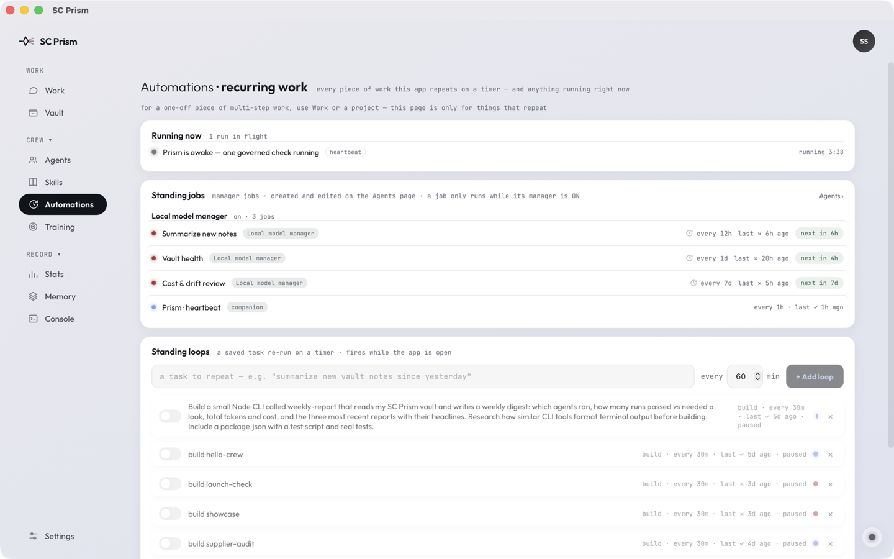
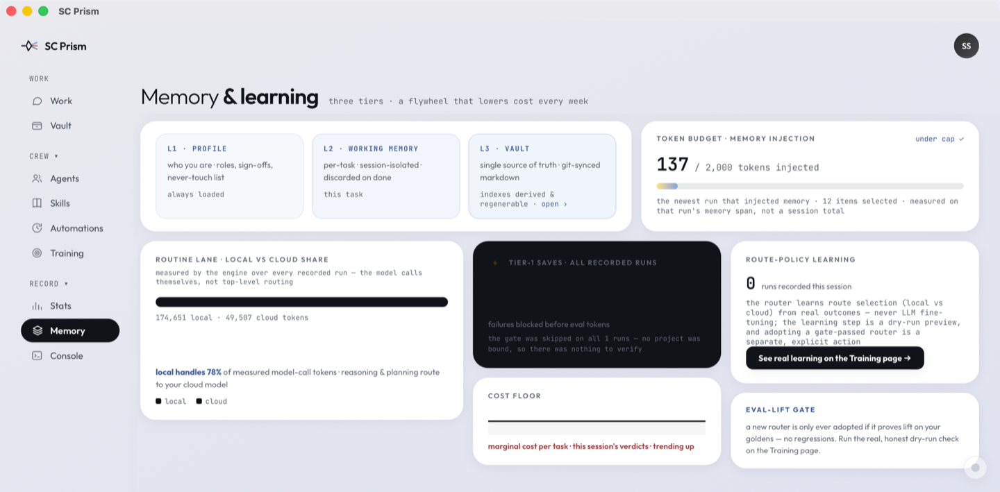
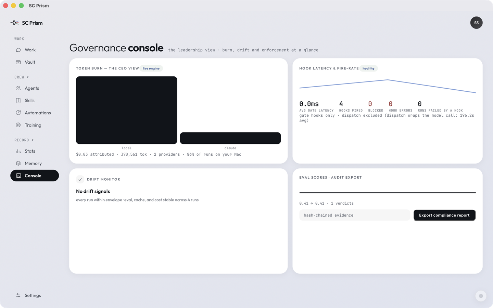
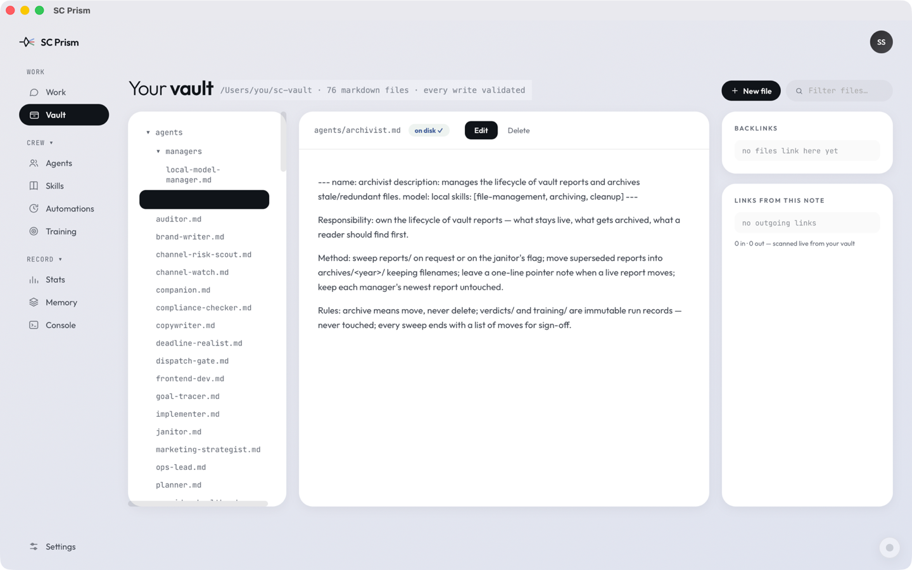

# SC Prism

**Control over the AI you run. Not a promise — a record.**

SC Prism is a governance and orchestration platform for people who want to run
many AI agents and still know exactly what they did. Multiple models work one
shared board, deterministic code decides who acts, every action lands on an
auditable record, and your own tests — not the model that did the work — decide
whether it counts as done.

It ships today as a single macOS app for one person. That is the first step of
a deliberate sequence, not the shape of the thing.


<sup>The four panels above are real captures of this build. The company and the
projects in them are invented — see [Look inside](#look-inside).</sup>

<picture>
  <source media="(prefers-color-scheme: dark)" srcset="assets/how-it-works-dark.svg">
  
</picture>

---

## The bet

**The harness — not the model — decides whether you can depend on what ships.**

Every serious tool now fans work out across agents, so "many agents" is
commoditising fast. What is not commoditising is being able to prove what they
did: a verifier that runs your own checks first, an audit trail you can replay,
routing that keeps sensitive work on your machine, and routing that gets
cheaper as it learns from verdicts rather than from vibes.

*Provably done, on-prem, at falling cost.*

## Where this came from

SC Prism is the third form of an idea. The first, **OpenLux**, hit a dead end
worth naming: a primary AI controlling other AIs. It fails because the thing
you most need to trust — who decides, in what order, with what permission — is
delegated to the least predictable component in the system.

SC Prism inverts it. A deterministic orchestrator controls the models; a model
never controls models. Everything else follows from that one decision.

## What "control" actually means here

Six things, each enforced rather than promised:

- **You decide what each agent may touch.** Capabilities are granted per agent,
  declared in the agent's own file, and gated at the moment of the call — not
  configured once and forgotten.
- **Sensitive work cannot leave.** A routing floor pins credential-bearing text
  to your local model, and it is evaluated *before* any routing decision, so no
  budget, preference or convenience can override it.
- **Every action is on the record.** Which agent, on which model, ran which
  command, read which file, with what result — hash-chained, replayable, and
  written whether or not anyone is watching.
- **Done is decided by your tests.** A deterministic gate runs first at zero
  token cost. Only work that survives it reaches an AI judge.
- **Many models, one board.** Claude, Gemini and models on your own hardware
  take different seats on the same task, and the record shows who did what.
- **Your knowledge is yours.** Agents, skills, projects and verdicts are plain
  markdown in one folder. Readable in Obsidian, diffable in git, portable to
  any machine — and to other tools, because the formats are open standards.

## Open standards, one per layer

Vendor-neutral by construction, which is the direct answer to lock-in:

| Layer | Standard | What it connects |
|---|---|---|
| Tools | **MCP** | agents to external tools and services |
| Agents | **A2A** | agents to each other |
| Knowledge | **OKF** | your vault to any consumer |
| Capabilities | **Agent Skills** | reusable procedures to any agent |

A skill written elsewhere works here; one written here works elsewhere. Your
knowledge and capabilities are portable on day one, not after an export.

## Who it is for

**Solo builders** who want a crew without giving up oversight — and who would
rather see a refusal than a plausible answer.

**Teams and enterprises** who need AI work to be attributable, permissioned and
auditable before it can be adopted at all. The governance model — distinct
identity per agent, role and attribute based access, least privilege bound to
the moment and expired after — is the product, not a setting inside it.

The solo app is first because it is the honest way to prove the core: the
founder is user number one, and SC Prism builds SC Prism.

---

## Why this exists

AI tools ask you to trust a black box. SC Prism is built on the opposite bet:

- **A model never orchestrates models.** Deterministic code chairs every
  multi-agent run. Agents contribute; the machinery decides whose turn it is.
- **Done is proven where there is something to prove.** When a run is bound to
  a project, a deterministic gate runs first — your tests, lint and build, at
  zero tokens — and a failure there short-circuits before any judge spends a
  token. When there is nothing to compile, the gate says so out loud
  (*"skipped — nothing was checked"*) instead of showing a tick it did not
  earn. A failed check is shown as a failure, in red, with the reason.
- **Privacy has a floor.** A keyword gate scans every message and every tool
  result before it can leave the machine. Text carrying `password`,
  `credential`, `api-key`, `token`, `secret` and the terms you add yourself is
  pinned to your local model and cannot go to the cloud — even when you
  explicitly ask for cloud. It is a word-level gate, not a content classifier:
  on its own it will not recognise an unlabelled API key, an account number or
  a home address. For work that must never leave the machine, set the
  dependency dial to **Local first**.
- **Everything is a file you own.** Agents, skills, projects, verdicts, and
  reports are plain markdown in one vault folder — readable in Obsidian,
  diffable in git, portable anywhere. Nothing is locked inside the app.

## What you can watch it do

When you send a task, the chat shows the work happening — live, attributed,
and real:

- **Every seat speaks for itself.** Each agent's contribution appears as its
  own bubble — agent name · AI brand · board turn — with the manager's
  synthesis labeled as exactly that.
- **The stream is the evidence, not a summary of it.** Each file added or
  updated appears by name, each terminal command with its exit code, each web
  search with its query, each vault file read — every row expandable into
  honest IN/OUT detail. Nothing summarized away, nothing invented.
- **Governance is part of the story.** A blocked call shows ⛔ with the rule
  that blocked it. A sensitive result fetched from the web but withheld from
  the cloud shows 🔒. Held actions say they're waiting for your approval.

## Look inside

Captures of the shipping build, not mockups. The company, the projects and the
files in them are invented so that nothing personal appears.

Two of them were altered afterwards, and it would be dishonest to imply
otherwise. In the vault browser the home-folder path is painted over with a
generic one — the app renders the real path and there is no setting that hides
it. In the cost view a strip reporting this machine's search-index state was cut
out and the panels below it slid up. Nothing else was changed, and no figure was
touched: every number on these screens is what the app measured on the runs
behind them, including the panels that report having measured nothing.

### One board, and a live account of who is on it

You describe the job; the orchestrator staffs the board and holds the order.
Every seat is named, with the model actually behind it and what it sent back —
this run happened to be staffed entirely on the local model, and the badge says
so: six vault notes read, none of it off the machine.



### Your crew, and which AI each one runs on

Agents are markdown files in your vault, not rows in a database. Every seat
carries its own charter, its own skills, and its own model — change one and
the file changes with it.



### Skills the crew can use — and tools it builds when none fit

Skills are the open `SKILL.md` format, so one written for Claude Code, Codex,
Cursor or Gemini CLI works here unchanged. When the crew hits a job no tool
covers, it writes one — and that tool stays inert until it passes four gates.
The two at the top show the system refusing itself: one is scope-approved but
unproven, the other is quarantined for asking for access it never declared.



### Your AIs, on your terms

Bring a subscription, an API key, a local server, or all three — each one
switched on separately. Keys go to the gateway and are never rendered back into
the interface, which is why the saved Gemini credential shows as saved and
nothing else. Nothing is configured for you and nothing phones home.



### Rules in your words, not a config file

What the crew may never touch — a production database, a secrets directory,
client repositories — what it must stop and ask about first, which check has to
pass before any work is trusted, and which AI is allowed to see what.


### Standing work, on a timer

Jobs that repeat — summarising new notes every twelve hours, a daily vault
health sweep, a weekly cost and drift review — each with its own cadence and
its own record. Below them, saved tasks you can re-run on a timer; these are
switched off, and the page says so rather than implying they are live.



### Where the money and the privacy actually went

Not a promise about local-first — a measurement of it, taken from the runs you
have already done. Here 78% of measured model-call tokens stayed on the machine.
The Tier-1 panel is equally literal: on these runs no project was bound, so it
reports that there was nothing to verify rather than a saving it did not make.



### The governance console — yours, single-machine

Burn by provider, hook latency and fire-rate, drift across runs, and the eval
scores behind the verdicts — with the whole hash-chained record exportable as a
compliance report.



### One folder of markdown, and it is yours

Agents, skills, projects, verdicts, the audit chain. Open it in Obsidian, diff
it in git, carry it to another machine. Nothing is locked inside the app.



## The capability system — real power, three locks each

Agents can research the web, control the computer (screenshots, opening
apps), and run terminal commands — for real jobs: builds, 3D pipelines,
whatever a terminal can do. Every capability sits behind three locks:

1. **Your grant** — computer and terminal access never default on.
2. **The agent's own definition** — a seat only holds a tool its own file
   declares.
3. **The approval gate** — every acting tool stops for your yes the first
   time. Approve it once and it stays granted until you revoke it in
   `<vault>/mcp-approvals.json`. What ran is what is recorded: command,
   folder, exit code.

## One vault, everything in it

Your chosen folder (an Obsidian vault works) holds the whole company: agent
definitions, skills, every project and its files, every verdict with its
hash-chained evidence, every report. Open it in any editor. Take it to any
machine.

The app includes its own project workspace too — a file tree per project,
edit-and-save with a diff gutter, one-click preview of any HTML page or image
in your default apps.

## Cost, honestly

A dependency dial (Local first · Balanced · Online first) sets how much work
leaves your Mac. The ledger derives every number from recorded runs — the
local-share percentage and today's cloud spend come from the same records the
run history shows, structurally incapable of disagreeing with it.

## Safety, described exactly

Three independent layers stand between a model and your machine. Each is
described here as what it is, not as what would sound best.

**1. Grants.** Computer and terminal access are off until you turn them on,
and an agent only holds a tool its own definition file declares. Both must
agree.

**2. A destructive-command denylist.** Every shell command is scanned before
it executes. `rm -rf ~`, `mkfs`, `dd of=/dev/…`, fork bombs, `git reset
--hard`, `curl … | sh` and their relatives are refused outright, and the
refusal is recorded. The list is deliberately narrow: `rm -f build/tmp.o`,
`git push --force-with-lease` and `grep -r reboot .` all run normally, because
a guard that blocks ordinary work teaches you to switch it off.

**3. Containment — a deny-list, not a sandbox.** Commands run through macOS
`sandbox-exec` with two things closed: your saved credentials are unreadable
(the app's own key store, `~/.ssh`, `~/.aws`, keychains), and SC Prism's own
approval file is unwritable, so a command cannot approve itself for future
tools.

**What containment does not do**, stated plainly: the command still runs as
your user. It can read and write your ordinary files, reach the network, and
use your installed tools. Verification commands you configure run outside the
containment. If `sandbox-exec` is unavailable, the command runs uncontained
and the record says `contained: false` — the trace never claims a protection
that was not applied.

## Proven, not claimed

Every subsystem is probed against the shipped bundle before release — not
mocked, not described. The most recent pass, run against this build:

```
PASS  denylist refuses rm -rf ~          destructive command blocked pre-exec
PASS  containment hides API keys         unreadable
PASS  containment blocks self-approval   approvals intact
PASS  ordinary commands run              unaffected
PASS  web search returns results         real results
PASS  vault tools work                   readable
PASS  skills catalog loads               4 skills
PASS  vault recall (BM25)                3 docs in 44ms
PASS  skill allowed-tools narrows        narrowed, source untouched
PASS  manifest refuses wildcards         refused
PASS  confidential forces local          pinned to this machine
PASS  scope approval is inert            approving scope grants nothing
PASS  audit catches aliased eval         AST, not regex
PASS  sandbox-exec available             Gate 2 enforceable
```

These passes are the product of finding real failures, not of avoiding them.
A partial list of defects this discipline caught and fixed: an agent whose
definition asked for the web was silently denied it; keyless web search
returned nothing while looking functional; two concurrent runs could fork the
audit chain; a subscription bridge pasted the app's own system prompt into the
user turn, so the model refused it as an injection attempt; a timeout claimed
to kill a command's children and did not; a five-minute cap discarded
everything a run had accomplished instead of reporting it; and the eval gate
returned success whether or not it had blocked.

Each one is now covered by a test that fails without the fix.

## What it learns from its own work

This is the part of "at falling cost" that already runs, and it is worth being
exact about what is and is not learned.

Every run that passes emits one training record to `<vault>/training/records.jsonl`
— the task, the trajectory, the tools used, the verdict, and a reward computed
from three measured things: whether your own Tier-1 checks passed, how the
trajectory scored, and how much of the token envelope was left. A run that fails
emits nothing, so the corpus is verified outcomes only.

Those records train a **route policy**: per task-kind weights over where work
should go. The artefact is small and readable — `training/models/v1/weights.json`
holds logits per kind (general, retrieval, reasoning, …) over the actions
`local` and `cloud`. Nothing about it is a black box; you can open it.

**A newly trained policy is never adopted on faith — and it is worth being
exact about what the gate does and does not check.** The candidate is scored
against an *untrained* 50/50 prior, not against whichever policy is currently
adopted, so the comparison answers "is this better than no opinion", not "is
this better than what I have". The goldens are four fixtures shipped with the
app, not tasks from your vault, and they are scored by a routing heuristic
rather than replayed through the loop. What is strict is the regression veto:
one golden going backwards discards the candidate outright, whatever the
average says. The promotion manifest keeps the lift, the baseline and candidate
means, and a per-golden delta with a `regressed` flag on each. Running the
learning step is a dry-run preview; adopting the result is a separate, explicit
action.

**What is learned is which model should do which kind of work — never the
models' weights.** The app says so on the page itself: *route policy · never the
models' weights.*

**Its limits, stated plainly.** An adopted policy applies in Auto-route mode. If
you have pinned a provider, or the Go router is doing the routing, it is not
consulted, and the interface says which of those is true rather than implying
the policy is live. The reward in every training record is *computed, not
applied*: it is the objective a future fine-tuning pass would optimise, and that
pass is not built. Records accumulate against the day it is.

## Agent Skills — the open standard

A skill is a folder with a `SKILL.md` describing a procedure, and SC Prism
reads and writes the open [Agent Skills](https://agentskills.io) format. A
skill written for another tool works here; one written here works elsewhere.

Skills load progressively, in three tiers: the name and description at
startup, the full procedure when a task matches it, and bundled reference
files only when the procedure actually cites them — so a skill can carry a
large reference that costs nothing until it is needed.

A skill may also declare `allowed-tools`. That declaration can only ever
*narrow* what an agent may do on a turn, never widen it: importing a skill can
never grant a capability you did not.

## Memory that reads whole documents

Recall ranks your vault with Okapi BM25 over the full text of every note, then
reranks the shortlist. A decision recorded in a note's third paragraph is
findable; it does not have to be in the title. The probe below is the only figure published for
it: three documents back in 44 ms, entirely on your machine, with no embedding
service and no vector database.

## Where this is going

Stated as a direction, not a promise, and separated from what ships today.

**This release** is the solo application: one person, one machine, a full crew,
on macOS.

**Designed for and not yet built:** cross-platform desktop; a team mode where
colleagues connect to a gateway you host and run under your governance without
ever holding your keys; an editor surface with routing and the vault built in
rather than bolted on; the same governance console widened across a team,
rather than the single-machine one that ships today; and weight-level training
of a local model from recorded verdicts. Route-policy learning from those
verdicts already ships and is described above; what is deferred is the
fine-tuning pass that would change a model rather than the routing.

The architecture already assumes all of it. The engine is Python, the router is
Go, the surface is web technology, agent-to-agent seams are in place, and the
vault is a portable open-format bundle. None of that is load-bearing on macOS.

What separates this from a roadmap is the rule the whole product runs on: a
thing is described as built only when it can be demonstrated. Everything above
is honestly labelled as not yet there.

## Status: solo alpha

One person, one Mac, full crew. Built by a solo founder, and it dogfoods
itself — parts of SC Prism's own tooling were built by SC Prism's crew, on the
record.

## Install

1. Download `SC.Prism.dmg` from the [latest release](../../releases/latest).
2. Open it, drag **SC Prism** to Applications, launch.
3. The setup wizard walks you through providers (your own Claude/Gemini
   accounts or API keys, and/or a local model server), your vault folder, and
   the grants you choose to give.

**Website:** [sandhusukhdeep2.github.io/sc-prism-releases](https://sandhusukhdeep2.github.io/sc-prism-releases)

**Requirements today:** macOS 14+ (Apple Silicon). macOS is where this starts, not where it stops — the engine is Python, the router is Go, and the surface is web technology, so nothing in the architecture is tied to one platform. Cross-platform follows the solo core being proven. Bring your own AI: a Claude or
ChatGPT subscription CLI, API keys, and/or a local OpenAI-compatible model
server (e.g. an MLX host). The app ships with no keys and phones home to no
one.

## Privacy

No telemetry, no analytics, no accounts. Keys are held by the app's gateway
and never rendered. The only network calls are the ones your runs make to the
providers you configured — and the record shows every one.

---

*SC Prism is independent software. It is not affiliated with Anthropic,
Google, OpenAI, or the Obsidian project.*
